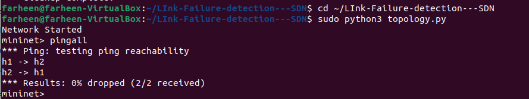

# Link Failure Detection and Recovery using SDN

## Problem Statement

This project demonstrates Link Failure Detection and Recovery using Software Defined Networking (SDN) using Mininet and POX Controller.

The objective is to detect network link failures and maintain connectivity by using alternate available paths dynamically.

---

## Objectives

- Monitor topology changes
- Detect link failure
- Update forwarding behavior
- Restore connectivity
- Demonstrate controller-switch interaction using OpenFlow

---

## Tools Used

- Ubuntu Virtual Machine
- Mininet
- POX Controller
- Open vSwitch
- Python

---

## Project Files

- `topology.py` → Creates custom Mininet topology
- `controller.py` → Custom POX controller logic
- `README.md` → Project documentation

---

## Network Topology

```text
h1 --- s1 --- s2
       |       |
       s3 --- s4 --- h2

---

## ▶️ How to Run

### Start POX

```bash
cd ~/pox
./pox.py forwarding.hub

---

## 📸 Output Screenshots

### Normal Connectivity


### Link Failure


### Recovery

